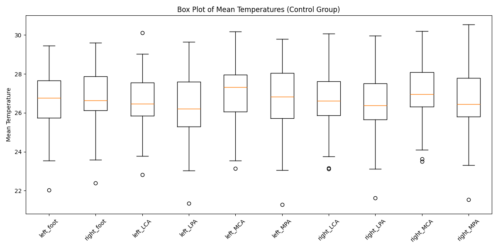
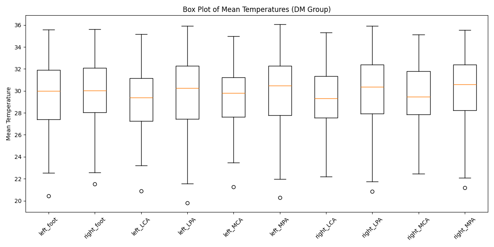
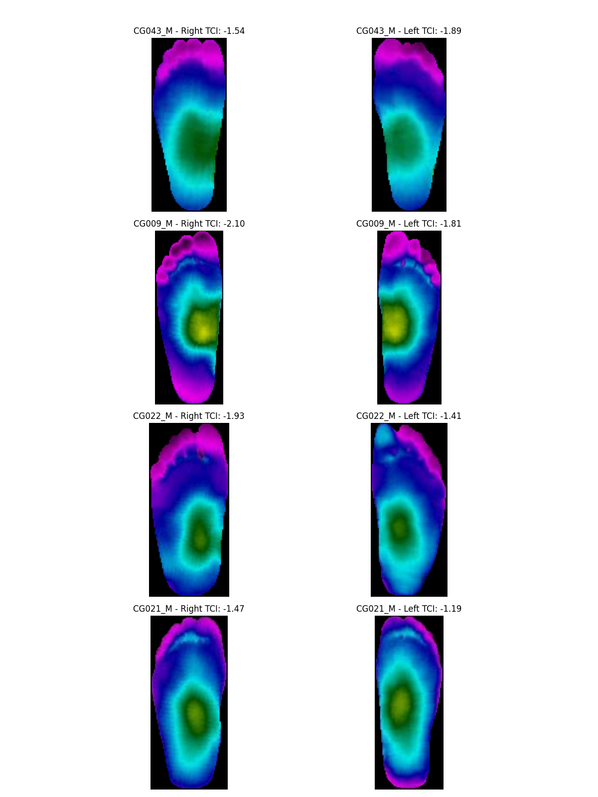
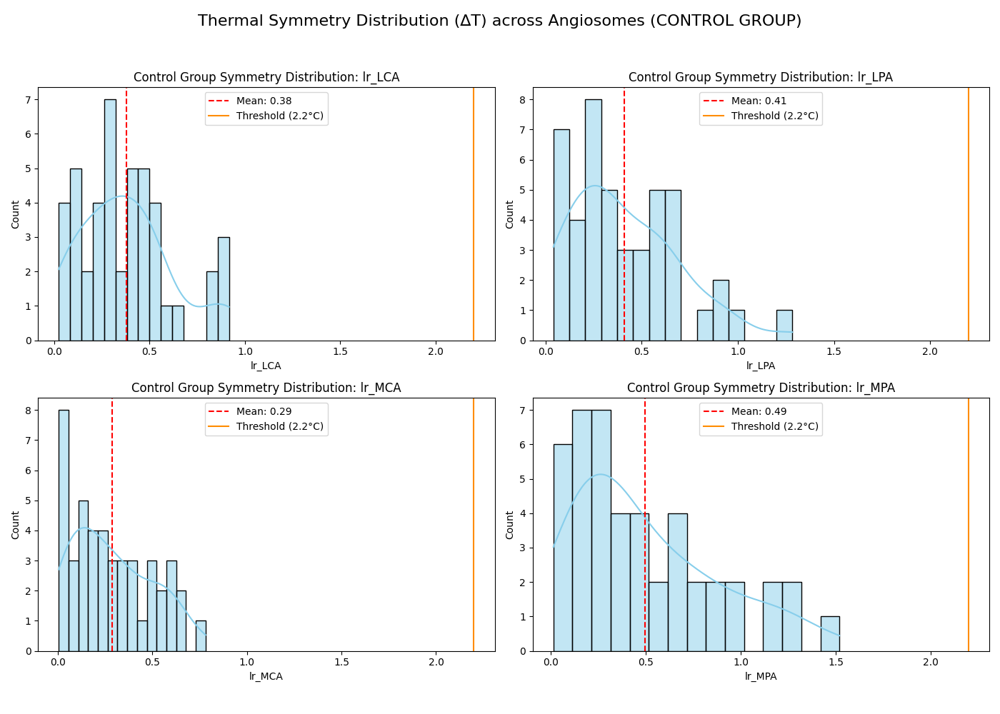

# Diabetic Foot Complication Analysis Project

## Project Goal
This project aims to develop a comprehensive system for the early detection and analysis of diabetic foot complications using thermographic imaging. By leveraging statistical analysis, signal processing, and machine learning, the project seeks to identify thermal anomalies indicative of risks such as ischemia and inflammation across different foot angiosomes.

The ultimate goal is to provide a non-invasive, automated diagnostic tool that can assist clinicians in early intervention, potentially preventing severe complications like ulceration and amputation.

## Project Overview
The codebase and analysis are structured into several key components covering the entire pipeline from raw data analysis to a user-facing diagnostic interface.

### 1. Exploratory Data Analysis (EDA)
Statistical comparison of **Control vs. Diabetes Mellitus (DM)** groups to understand baseline thermal differences.
*   **Focus**: Angiosome temperature distributions and Temperature Change Index (TCI) values.
*   **Key Visualizations**:
    *   **Boxplots**: Comparing temperature ranges between groups.
    *   **Symmetry Analysis**: Assessing bilateral thermal differences (Left vs. Right foot), where significant asymmetry often indicates pathology.
    *   **Correlation Heatmaps**: Understanding relationships between different angiosomes.

*Figure 1: Comparison of mean temperatures across different foot regions for Control and DM groups.*

### 2. Preprocessing & Segmentation Report
Visual validation of the **"Hybrid Segmentation"** technique, which combines Histogram-based thresholding with Morphological operations.
*   **Objective**: To accurately isolate the foot region from the background, even in challenging "Cold/Ischemic" feet where thermal contrast is low.
*   **Validation**:
    *   Demonstration of successful segmentation on noisy or low-contrast thermograms.
    *   Validation images showing the mask overlay on original thermal images.

*Figure 2: Visual validation of segmentation steps.*

### 3. End-to-End Signal Processing Pipeline
A fully integrated code block processing raw thermograms into diagnostic signals.
*   **Stages**:
    *   **Segmentation**: Extracting the foot ROI (Region of Interest).
    *   **Registration**: Aligning images for accurate anatomical comparison.
    *   **Symmetry Logic**: Calculating the absolute temperature difference between corresponding angiosomes on the left and right feet ($|T_{left} - T_{right}|$).

*Figure 3: Symmetry analysis plots highlighting thermal differences.*

### 4. Sensitivity Analysis & Threshold Tuning
Performance evaluation of diagnostic thresholds using Receiver Operating Characteristic (ROC) analysis.
*   **Goal**: To determine the optimal temperature difference threshold for classifying significant asymmetry.
*   **Analysis**:
    *   **ROC Curve**: Demonstrating performance trade-offs (True Positive Rate vs. False Positive Rate).
    *   **Threshold Comparison**: Evaluating specific thresholds, such as **1.8°C** vs. **2.6°C**, to balance sensitivity and specificity according to clinical needs.

### 5. Final Evaluation Report
A comprehensive report listing diagnostic and technical performance metrics.
*   **Diagnostic Metrics**:
    *   **Sensitivity**: Ability to correctly identify positive cases (risk).
    *   **Specificity**: Ability to correctly identify negative cases (healthy).
    *   **F1-Score**: Harmonic mean of precision and recall.
*   **Segmentation Metrics**:
    *   **Dice Coefficient**: Measuring the overlap accuracy of the automated segmentation against ground truth masks.

### 6. Streamlit Diagnostic Dashboard (Future Work)
A planned web-based interface for easy deployment and usage by clinicians.
*   **Features**:
    *   **User Upload**: Drag-and-drop interface for thermogram files.
    *   **"Traffic Light" Diagnosis**: Instant visual feedback:
        *   🟢 **Normal**: No significant thermal asymmetry.
        *   🟡 **Local Risk**: Asymmetry detected in specific angiosomes.
        *   🔴 **Diffuse Risk**: Widespread thermal anomalies.
    *   **Visualization**: Interactive display of checking specific angiosomes.

## Architecture
*   **Language**: Python
*   **Notebook**: `Jubril's Notebook.ipynb` (Main analysis and pipeline code)
*   **Data Source**: `ThermoDataBase` (Contains Control and DM group thermal data)

## Getting Started
1.  Ensure you have the required dependencies installed (e.g., `numpy`, `pandas`, `matplotlib`, `seaborn`, `opencv-python`, `scikit-learn`).
2.  Open `Jubril's Notebook.ipynb` in Jupyter/Lab.
3.  Run the cells sequentially to reproduce the EDA, Preprocessing, and Analysis steps.

---
*Created as part of the Thermograph Images CV2 ML Project.*
